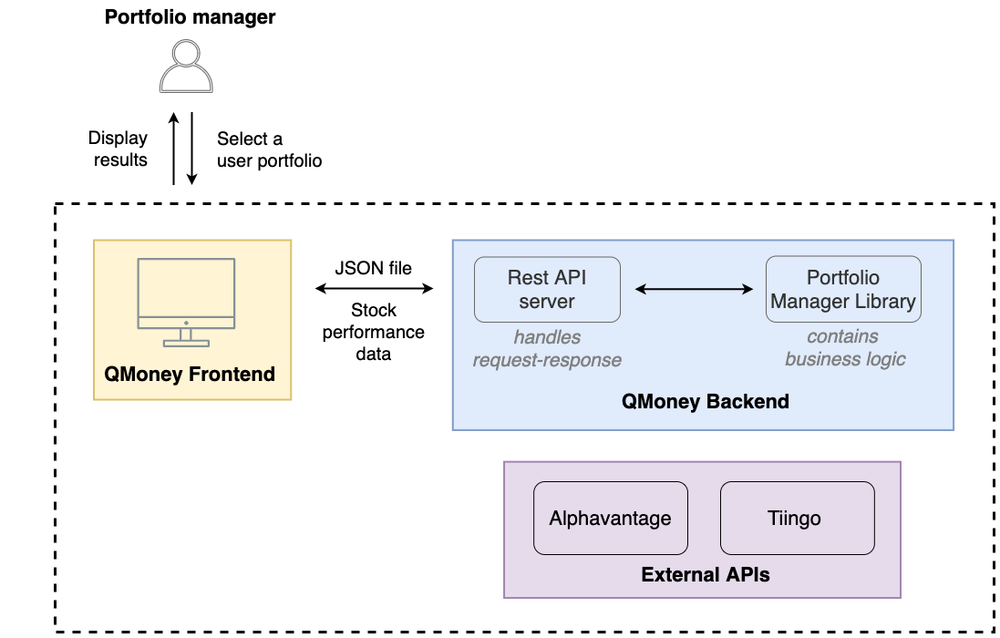
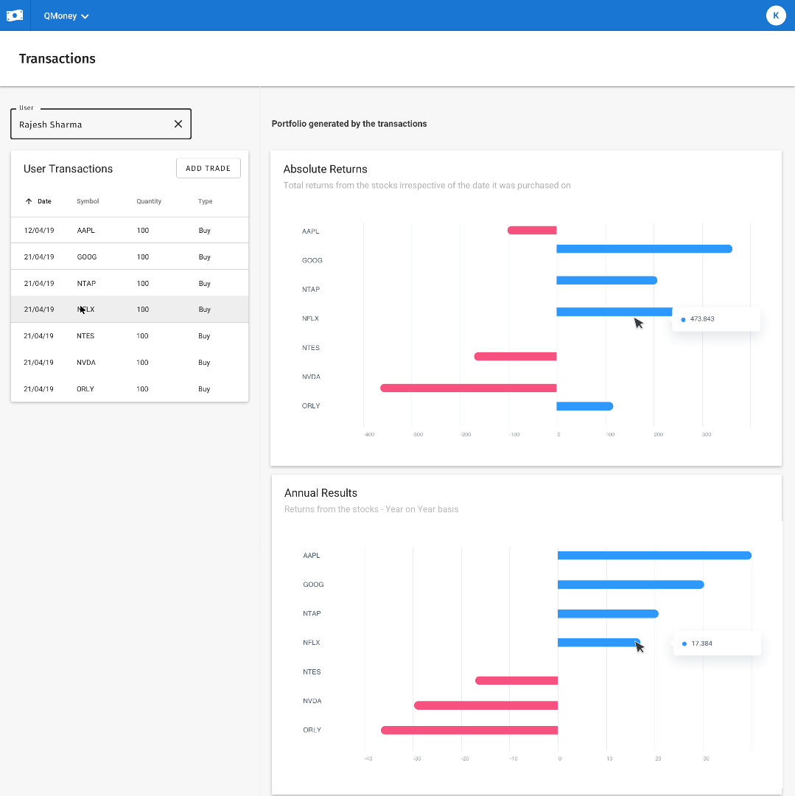

# QMoney

QMoney is a visual stock portfolio analyzer. It helps portfolio managers make trade recommendations for their clients.

During this Micro-Experience-

- Implemented the core logic of the portfolio manager and published it as a library.
- Refactored code to add support for multiple stock quote services.
- Improved application stability and performance.

## QMoney Architecture

  
  <b>Basic Concept Image</b>

 

  
  <b>QMoney Portfolio Manager Interface</b>
   

## QMoney Modules

1.  Fetch stock quotes and compute annualized stock returns

    - Used Tiingo’s REST APIs to fetch stock quotes.
    - Computed the annualized returns based on stock purchase date and holding period.
    - Skills Learned:
      - Java, REST API, Jackson  

2.  Refactor using Java interfaces and publish a JAR file

    - Refactored code to adapt to an updated interface contract published by the backend team.
    - Published the portfolio manager library as a JAR for easy versioning and distribution.
    - Created examples to help document library (JAR) usage.
    - Skills Learned:
      - Interfaces, Code Refactoring, Gradle

3.  Improve application availability and stability
    - Added support for a backup stock quote service (Alpha Vantage) to improve service availability.
    - Improved application stability with comprehensive error reporting and better exception handling.
    - Skills Learned:
      - Interfaces, Exception Handling
